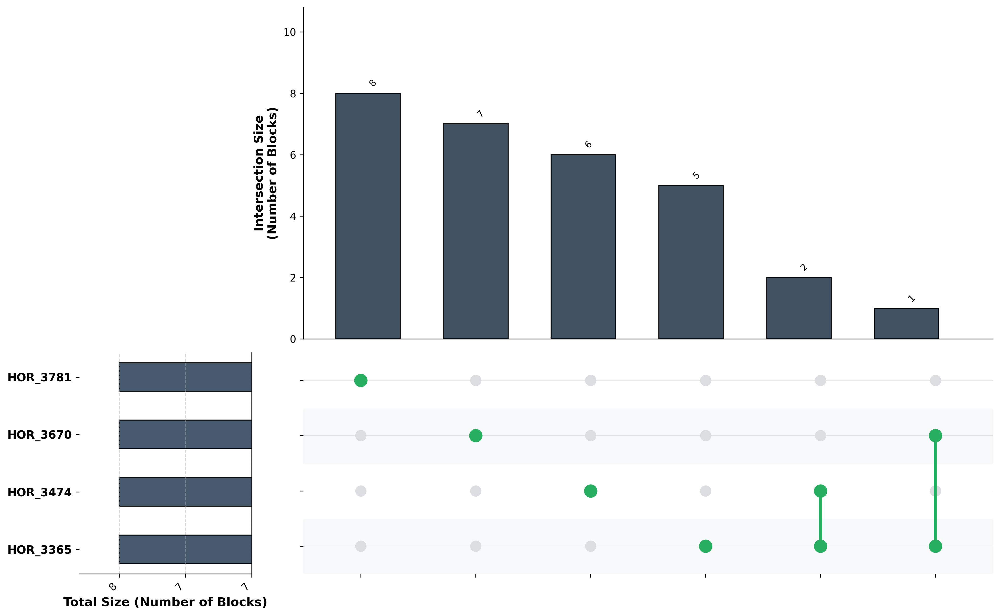

# PHGv2Tools

Package for downstream analysis of pangenome databases, working with Practical Haplotype Graph (PHGv2) and its h.VCF files.

> **Note:** For any comment or feedback, feel free to contact: jsarria@eead.csic.es

## Contents
- [Introduction](#introduction)
- [Installation](#installation)
- [Available Commands](#available-commands)
- [Usage](#usage)
- [References](#references)

## Introduction

Repository written in Python to perform downstream analysis of [Practical Haplotype Graph](https://phg.maizegenetics.net/). 

It mainly works with [h.VCF](https://phg.maizegenetics.net/hvcf_specifications/) files, a modified version of [VCF 4.2](http://samtools.github.io/hts-specs/VCFv4.2.pdf), g.VCF, and derivated files from those; such as the hapIDranges.tsv that PHG produces to structurate the data, the merging of several genotypes of the pangenome for the VCFs, or .bed files summaryzing even more the haplotype block structure. 

### Pangenome haplotypes VCFs
The pangenome graph is built from the reference genome with ranges based on annotated genes. With PHG's [Create VCF files](https://phg.maizegenetics.net/build_and_load/#create-vcf-files) module, a haplotype file for each genome is obtained as h.VCF. It's useful to [merge the VCFs](https://github.com/maize-genetics/phg_v2/blob/main/src/main/kotlin/net/maizegenetics/phgv2/cli/MergeHvcfs.kt) for whole-graph analysis.

### Imputed haplotypes VCFs
[Imputation](https://phg.maizegenetics.net/imputation/) achieves complete genomes from low-density sequence data. The output h.VCF files can be analyzed with several modules.


### Example database
For a practical, step-by-step guide, see the [`Example_database/README.md`](Example_database/README.md) file in this repository. This README demonstrates how to generate, organize, and handle all files required by PHGv2Tools, covering the full workflow from raw data to analysis and visualization. This is the best starting point if you want to reproduce or understand the complete process with real data and outputs.


## Installation

### Quick Setup (Recommended)
```bash
git clone https://github.com/jsarriaa/PHGv2Tools.git
cd PHGv2Tools
bash Misc/CondaSetup.sh
conda activate phgtools
```

This creates a conda environment named `phgtools` with all dependencies and installs the package.

### Manual Installation
If you prefer to manage dependencies yourself:
```bash
git clone https://github.com/jsarriaa/PHGv2Tools.git
cd PHGv2Tools
pip install .
```

### Verify Installation
```bash
phgtools --version
phgtools --check-setup
```

### Dependencies
PHGv2Tools requires:
- **Python ≥3.6**
- **samtools** (for `fasta-from-key` module)
- Python packages: matplotlib, pandas, scipy, numpy, tqdm, openpyxl, rich, seaborn

Run `phgtools --check-setup` to verify all dependencies are properly installed.

## Available Commands

| Command | Description |
|---------|-------------|
| `hvcf2bed` | Convert h.VCF files to BED format for visualization |
| `haplopainting` | Generate haplotype painting visualizations from h.VCF files |
| `fasta-from-key` | Extract FASTA sequence from a PHGv2 key/hash |
| `range-pangenome-evolution` | Analyze pangenome evolution: cumulative growth of ranges and unique haplotype keys |
| `genome-intersection` | Analyze genome intersection from map_kmers output and BED file |
| `upset-plot` | Generate UpSet plot from a `hapIDranges.tsv` pangenome file |
| `core-range-detector` | Detect and analyze core, unique, and accessory ranges from pangenome hVCF |
| `check-haplotype-alleles` | Query a pangenome hapIDranges.tsv for overlapping genomic ranges |
| `check-imputated-haplotype` | Check genomic content contribution of source genomes to an imputed haplotype |
| `plot-imputed-hvcf` | Plot imputed hVCF files showing genome-colored haplotype ranges |
| `vcf-distance` | Generate distance matrix comparing all varieties in a g.VCF file with heatmap |
| `manage-hbed-inversions` | Collapse inversion blocks from h.bed files with summary and optional plot |

Run `phgtools <command> --help` for detailed usage of each command.

## Usage

### hvcf2bed
Convert h.VCF files to BED format for visualization tools.

| Argument | Required | Description |
|----------|----------|-------------|
| `vcf_folder` | Yes | Path to folder containing h.vcf files |
| `genome_name` | No | Genome name. If not provided, converts all h.vcf files in folder |
| `-v, --verbose` | No | Enable verbose output |

**Examples:**
```bash
# Convert a specific genome
phgtools hvcf2bed /path/to/vcf/folder GenomeName

# Convert all h.vcf files in folder
phgtools hvcf2bed /path/to/vcf/folder

# With verbose output
phgtools hvcf2bed /path/to/vcf/folder -v
```

---

### manage-hbed-inversions
Process inversion blocks from a `.h.bed` file. Keeps only `-` strand blocks, collapses concatenated blocks, prints a summary, and can save summary + plot outputs.

| Argument | Required | Description |
|----------|----------|-------------|
| `input_hbed` | Yes | Input h.bed file |
| `output_hbed` | Yes | Output collapsed inversion h.bed file |
| `--max-gap` | No | Maximum allowed bp gap to still merge consecutive inversion blocks (default: 0) |
| `--summary-file [path]` | No | Save summary text; if no path is provided, writes `<output_hbed>.summary.txt` |
| `--plot-file [path]` | No | Save haplopaint-style inversion PNG; if no path is provided, writes `<output_hbed>.png` |

**Examples:**
```bash
# Basic inversion collapse
phgtools manage-hbed-inversions sample.h.bed sample.inversions.collapsed.h.bed

# Save summary + plot using auto filenames
phgtools manage-hbed-inversions sample.h.bed sample.inversions.collapsed.h.bed --summary-file --plot-file

# Merge inversions allowing up to 1000 bp gap
phgtools manage-hbed-inversions sample.h.bed sample.inversions.collapsed.h.bed --max-gap 1000
```

---

### haplopainting
Generate haplotype painting visualizations from h.VCF files, showing which pangenome haplotypes are present across chromosomes.

| Argument | Required | Description |
|----------|----------|-------------|
| `--hvcf-folder` | Yes | Path to folder containing h.vcf files |
| `--samples-list` | Yes | Path to grouped samples file (TSV with Sort, Genotype, Group columns) |
| `-c, --chromosome` | No | Chromosome(s) to plot (e.g., chr1H chr2H). Multiple allowed |
| `-r, --region` | No | Region to plot in format START-END (e.g., 1000-2000) |
| `--plot-pangenome-references` | No | Include pangenome samples in plots |
| `-v, --verbose` | No | Enable verbose output |

**Examples:**
```bash
# Plot all chromosomes
phgtools haplopainting --hvcf-folder output/vcf_files/ --samples-list samples.tsv

# Plot specific chromosomes
phgtools haplopainting --hvcf-folder output/vcf_files/ --samples-list samples.tsv -c chr1H chr2H

# Plot a specific region
phgtools haplopainting --hvcf-folder output/vcf_files/ --samples-list samples.tsv -c chr1H -r 1000000-2000000
```

---

### core-range-detector
Analyze core, accessory and unique ranges from a merged pangenome h.VCF file. Determines which ranges are found in all, some, or only one genome.

| Argument | Required | Description |
|----------|----------|-------------|
| `HVCF_FILE` | Yes | Path to merged pangenome hVCF file (.h.vcf or .h.vcf.gz) |
| `-v, --verbose` | No | Enable verbose output |

**Output:** Bar plot of range distribution and pie chart of core/accessory/unique percentages.

**Examples:**
```bash
phgtools core-range-detector output/MergedLinesA_B_C.h.vcf
phgtools core-range-detector output/MergedLinesA_B_C.h.vcf -v
```

---

### range-pangenome-evolution
Analyze how the pangenome grows as genomes are added. Plots cumulative range acquisition showing how adding each genome contributes new ranges.

| Argument | Required | Description |
|----------|----------|-------------|
| `hapid_ranges_file` | Yes | Path to the hapIDranges.tsv (or .tsv.gz) file |
| `-r, --reference` | No | Name of the reference genome. If not provided, prompted to select one |
| `-v, --verbose` | No | Print detailed execution and cumulative growth logs |

**Examples:**
```bash
phgtools range-pangenome-evolution output/hapIDranges.tsv
phgtools range-pangenome-evolution output/hapIDranges.tsv -r MorexV3 -v
```

---

### upset-plot
Generate an UpSet plot summarizing exact haplotype-hash intersections across genomes from a `hapIDranges.tsv` file.

| Argument | Required | Description |
|----------|----------|-------------|
| `hapid_ranges_file` | Yes | Path to the `hapIDranges.tsv` (or .tsv.gz) file |
| `--mode` | No | `blocks` (count) or `bp` (base pairs). Default: `blocks` |
| `--top` | No | Number of top intersections to display (default: 30) |
| `--out` | No | Output PNG filename (default: `pangenome_upset.png`) |
| `--verb` | No | Print progress messages to the terminal in real time. |

**Examples:**
```bash
# Generate default upset plot (top 30 intersections) and print progress
phgtools upset-plot output/hapIDranges.tsv --out upset.png --verb
```

**Example output:**



---

### check-haplotype-alleles
Query a pangenome for haplotype ranges overlapping specific genomic coordinates. If coordinates are not provided via command line, you will be prompted to enter them.

| Argument | Required | Description |
|----------|----------|-------------|
| `hapid_ranges_file` | Yes | Path to the merged hapIDranges.tsv file |
| `-c, --chromosome` | No | Chromosome name (e.g., 'chr1H') |
| `-s, --start` | No | Start coordinate (e.g., 10000) |
| `-e, --end` | No | End coordinate (e.g., 10500) |
| `-v, --verbose` | No | Print debug statements showing all checks |

**Examples:**
```bash
# Interactive mode (will prompt for coordinates)
phgtools check-haplotype-alleles output/hapIDranges.tsv

# Full command line
phgtools check-haplotype-alleles output/hapIDranges.tsv -c chr3H -s 101659993 -e 101663495 -v
```

---

### check-imputated-haplotype
Analyze which pangenome source genomes contribute to an imputed haplotype. Calculates percentage contribution by base pair coverage.

| Argument | Required | Description |
|----------|----------|-------------|
| `pangenome_folder` | Yes | Path to folder containing source pangenome *.h.vcf.gz files |
| `imputed_hvcf` | Yes | Path to the imputed hVCF file (can be gzipped or not) |
| `-o, --output` | No | Output directory for results (default: current directory) |
| `-v, --verbose` | No | Print detailed processing messages |

**Examples:**
```bash
phgtools check-imputated-haplotype output/vcf_files/ imputed/sample.h.vcf -v
phgtools check-imputated-haplotype output/vcf_files/ imputed/sample.h.vcf -o results/ -v
```

---

### plot-imputed-hvcf
Plot imputed hVCF files showing genome-colored haplotype ranges across all chromosomes.

| Argument | Required | Description |
|----------|----------|-------------|
| `pangenome_hvcf_folder` | Yes | Path to folder containing pangenome hVCF files |
| `imputed_hvcf` | Yes | Path to the imputed hVCF file |
| `reference_hvcf` | Yes | Path to the reference hVCF file |
| `-o, --output` | No | Output directory for plots (default: pangenome_folder/plots) |
| `-v, --verbose` | No | Print detailed processing messages |

**Examples:**
```bash
phgtools plot-imputed-hvcf output/vcf_files/ imputed/sample.h.vcf reference/Ref.h.vcf.gz
phgtools plot-imputed-hvcf output/vcf_files/ imputed/sample.h.vcf reference/Ref.h.vcf.gz -o plots/ -v
```

---

### genome-intersection
Analyze genome intersection from PHG `map-kmers` output. Determines how many ranges from a pangenome genome are matched.

| Argument | Required | Description |
|----------|----------|-------------|
| `map_kmers_file` | Yes | Path to the map_kmers output file |
| `--bed-file` | Yes | Path to the BED file generated by hvcf2bed (reference coordinates in columns 7-10) |
| `--genome-fasta` | Yes | Path to the reference genome FASTA file (used to get actual chromosome lengths) |
| `-v, --verbose` | No | Enable verbose output |

**Examples:**
```bash
phgtools genome-intersection readMapping.txt --bed-file pangenome.bed --genome-fasta reference.fa -v
```

---

### fasta-from-key
Extract FASTA sequence from a pangenome range using its MD5 hash key.

> **Requires:** Indexed FASTA files with `samtools faidx`

| Argument | Required | Description |
|----------|----------|-------------|
| `--key` | Yes | The haplotype key/hash to extract |
| `--fastas-folder` | Yes | Folder containing the genome assemblies (.fa files) |
| `--vcf-file` | Yes* | Path to a VCF file to search (*one of vcf-file or vcf-folder required) |
| `--vcf-folder` | Yes* | Path to folder containing h.vcf files to search (*one of vcf-file or vcf-folder required) |
| `--output-folder` | No | Output folder to save the FASTA file |

**Examples:**
```bash
# Search in a single VCF file
phgtools fasta-from-key --key 3efc16790e55a2a8334c939d0795dfde --fastas-folder data/genomes/ --vcf-file merged.h.vcf

# Search in a folder of VCF files
phgtools fasta-from-key --key 3efc16790e55a2a8334c939d0795dfde --fastas-folder data/genomes/ --vcf-folder output/vcf_files/

# Save output to file
phgtools fasta-from-key --key 3efc16790e55a2a8334c939d0795dfde --fastas-folder data/genomes/ --vcf-folder output/vcf_files/ --output-folder results/
```

---

### vcf-distance
Generate a distance matrix comparing all varieties in a g.VCF file. Optionally produces a clustered heatmap visualization with dendrogram.

| Argument | Required | Description |
|----------|----------|-------------|
| `vcf_file` | Yes | Input VCF file (.vcf.gz compressed or plain .vcf text) |
| `-o, --out-matrix` | No | Output distance matrix file path (default: distance_matrix.tsv) |
| `-p, --heatmap-plot` | No | Generate heatmap PNG (300 DPI). Default filename: distance_heatmap.png |
| `-t, --threads` | No | Number of threads for parallel processing (default: 1). Use -1 for all cores |
| `-v, --verbose` | No | Print detailed processing messages |

**Output:**
- `distance_matrix.tsv` - Pairwise distance matrix (1 = identical)
- `distance_matrix_count.tsv` - Count of shared SNPs per pair
- `distance_heatmap.png` - Clustered heatmap with dendrogram (if `-p` flag used)

**Examples:**
```bash
# Basic usage - generates distance and count matrices
phgtools vcf-distance pangenome.g.vcf.gz

# With heatmap visualization
phgtools vcf-distance pangenome.g.vcf.gz -p

# Custom output path and heatmap
phgtools vcf-distance pangenome.g.vcf.gz -o results/distances.tsv -p results/heatmap.png

# Parallel processing with 8 threads
phgtools vcf-distance pangenome.g.vcf.gz -t 8 -p -v

# Use all available CPU cores
phgtools vcf-distance pangenome.g.vcf.gz -t -1 -p -v
```

---


## References
The Practical Haplotype Graph, a platform for storing and using pangenomes for imputation. https://doi.org/10.1093/bioinformatics/btac410
